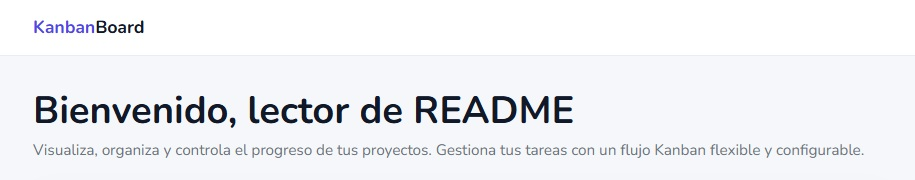

Aplicación de gestión de proyectos tipo Kanban desarrollada en Laravel, orientada a organizar tareas de forma visual, flexible y escalable.

---

## Descripción general

KanbanBoard es una aplicación web basada en un sistema de columnas que permite gestionar tareas dentro de proyectos de forma intuitiva.

A diferencia de otros sistemas cerrados, **no está limitado a una estructura fija**:  
los estados (columnas) son completamente configurables, permitiendo adaptar el flujo de trabajo a cada proyecto.

---

## Índice

- [Inicio](#inicio)
- [Autenticación](#autenticación)
- [Proyectos](#proyectos)
- [Tareas](#tareas)
  - [Estados y prioridades](#estados-y-prioridades)
  - [Tablero Kanban](#tablero-kanban)
  - [Vista de tarea](#vista-de-tarea)
  - [Comentarios](#comentarios)
  - [Adjuntos](#adjuntos)
  - [Actividad](#actividad)
- [Notificaciones](#notificaciones)
- [Arquitectura técnica](#arquitectura-técnica)

---

## Inicio

Vista principal de la aplicación.

Permite acceder rápidamente a los proyectos y al sistema Kanban sin sobrecargar la interfaz.

---

## Autenticación

Sistema de autenticación estándar de Laravel:

- Registro de usuarios  
- Inicio de sesión mediante email  
- Gestión de sesión  

---

## Proyectos

Los proyectos agrupan tareas y representan unidades independientes de trabajo.

Cada proyecto permite:

- Gestionar sus propias tareas  
- Definir su flujo de trabajo  
- Acceder a su tablero Kanban  

---

## Tareas

Las tareas representan el trabajo dentro de un proyecto.

Incluyen:

- Título  
- Descripción  
- Estado  
- Prioridad  
- Usuario asignado  
- Fechas estimadas  

---

### Estados y prioridades

**Estados (columnas Kanban):**

- Totalmente configurables  
- Se pueden crear, editar y ordenar  
- No existe límite de columnas  

Esto permite adaptar el flujo a cualquier tipo de proyecto.

**Prioridades:**

- Baja  
- Media  
- Alta  

---

### Tablero Kanban

Vista principal de trabajo.

Permite:

- Visualizar tareas por estado  
- Mover tareas entre columnas (drag & drop)  
- Reordenar tareas dentro de una columna  
- Crear tareas directamente en el tablero  
- Acceder al detalle de cada tarea  

---

### Vista de tarea

Cada tarea dispone de una vista de detalle donde se puede:

- Editar información  
- Cambiar estado y prioridad  
- Modificar fechas  
- Ver información de creación y actualización  
- Eliminar la tarea  

Actúa como centro de gestión de la tarea.

---

### Comentarios

Sistema de comentarios por tarea:

- Comunicación entre usuarios  
- Texto simple  
- Historial de mensajes  

---

### Adjuntos

Gestión de archivos en tareas:

- Subida  
- Descarga  
- Eliminación  

Implementado con **Spatie Media Library**.

---

### Actividad

Registro automático de cambios:

- Cambios de estado  
- Asignaciones  
- Ediciones  

Permite seguimiento completo de la tarea.

---

## Notificaciones

Notificaciones integradas en la interfaz:

- Tareas asignadas al usuario  
- Acceso rápido al listado  
- Filtrado por estado  

---

## Arquitectura técnica

- Laravel 12  
- Blade + JavaScript  
- MySQL  
- Spatie Media Library  
